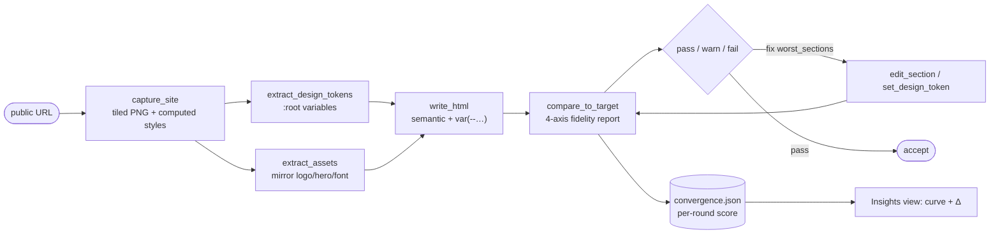
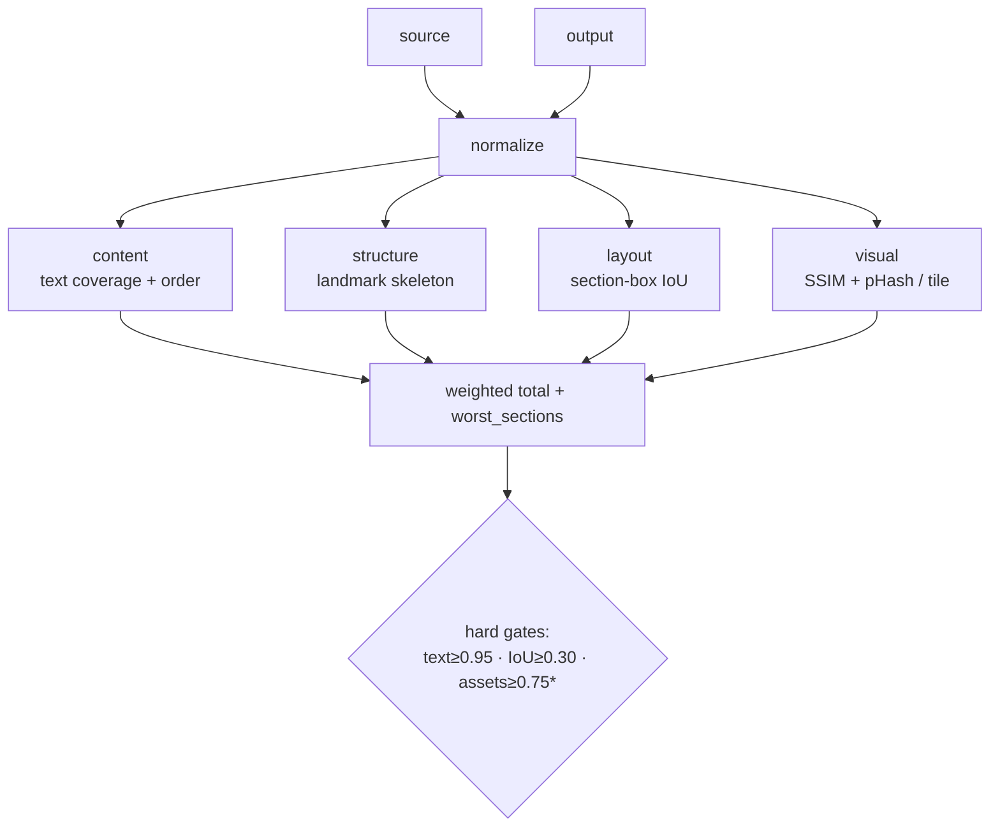
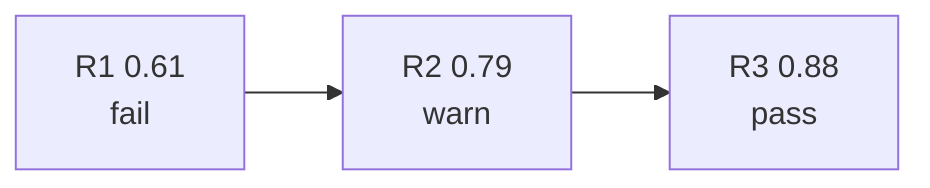
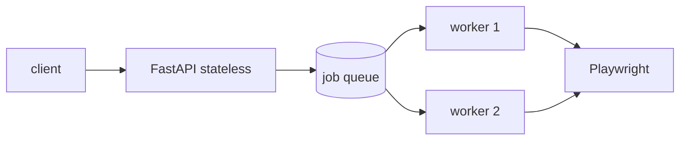
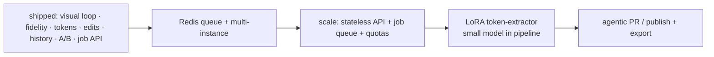

# APPROACH

> **URL in → clean, editable, near-pixel template → refine in chat.**
> One agent, a focused toolset, and a measured `look → build → measure → fix` loop.

**Companion docs**: [`IDEA.md`](IDEA.md) (full plan) · [`docs/ADR.md`](docs/ADR.md) (decisions) · [`docs/INTERVIEW.md`](docs/INTERVIEW.md) (per-phase notes)

---

## 1. Thesis

| The bet | Why it wins the rubric |
|---------|------------------------|
| The agent must **see pixels**, not guess from text | Replaces "looks off" with "copy from the screenshot" |
| **Measure** fidelity, don't eyeball it | 4-axis score + hard gates make quality gateable, not anecdotal |
| **Self-converge**: build → score → fix worst sections | This is the gap vs. a one-shot LLM (README's bar) |
| **Tokens + section edits**, not full rewrites | "Almost the same" *and* easy to rebrand / iterate |

Headline result (benchmark set, `more_faithful`, fabricated illustrative numbers):

| | Naked one-shot | Full loop | Δ |
|---|---|---|---|
| **Mean fidelity** | **0.67** | **0.90** | **+0.23** |

---

## 2. What I built



**Capabilities added on top of the scaffold** (`write_html` / `read_html` only):

| Area | What | Tool / surface |
|------|------|----------------|
| Eyes | Playwright tiled screenshots + computed-style JSON | `capture_site`, `screenshot_output` |
| Tokens | Computed styles → canonical `:root` vars | `extract_design_tokens`, `read_design_tokens`, `set_design_token` |
| Assets | Mirror logo / hero / SVG / fonts locally | `extract_assets` |
| Measure | 4-axis fidelity + hard gates + diff heatmap | `compare_to_target`, `/compare` |
| Surgical edits | One-block replace, no full rewrite | `edit_section` |
| Reliability | Snapshot-before-write, rollback, diff, friendly errors | `/history`, `/history/rollback` |
| Proof | Per-round convergence + unguided A/B baseline | Insights view, `/ab` |

**10 MCP tools** + `WebFetch` / `WebSearch`, behind one agent with a profile-aware system prompt.

---

## 3. Fidelity model (the core IP)

Four independent axes — a single pixel diff is too fragile (different copy moves pixels but may still be "the right page").



**Two-layer scoring**: per-axis hard gates (a fail caps the verdict) **+** a normalized weighted total → `pass / warn / fail`.

**Fidelity profiles** tune weights + gates for intent:

| Profile | Optimizes | Structure weight | `asset_coverage` gate |
|---------|-----------|------------------|------------------------|
| `more_editable` | clean, semantic code | 0.00 | off |
| `balanced` *(default)* | layout + visual match | 0.05 | off |
| `more_faithful` | pixel + real assets | 0.00 | **≥ 0.75** |

---

## 4. Evidence (illustrative benchmark data)

Benchmarks: `stripe`, `linear`, `vercel`, `resend` (`data/benchmarks.json`).

**A/B — unguided one-shot vs. full loop** (total fidelity, `more_faithful`):

| Site | One-shot | Full loop | Δ | Rounds to pass |
|------|---------:|----------:|----:|:--------------:|
| stripe | 0.61 | 0.88 | +0.27 | 3 |
| linear | 0.68 | 0.91 | +0.23 | 2 |
| vercel | 0.72 | 0.93 | +0.21 | 2 |
| resend | 0.66 | 0.89 | +0.23 | 3 |
| **mean** | **0.67** | **0.90** | **+0.23** | **2.5** |

**Per-axis (stripe, final)**: content `0.94` · structure `0.86` · layout `0.88` · visual `0.84` · assets `0.79`.

**Convergence (stripe)** — the loop climbs past the pass line by round 3:



**Cost / latency** (haiku, local): capture ≈ 4–6 s · full first build ≈ 30–60 s · self-check round ≈ 8–12 s.

---

## 5. Key decisions & tradeoffs

| Decision | Why | Tradeoff |
|----------|-----|----------|
| Claude Agent SDK + **CLI transport** | Matches starter; CLI login = no key wiring | Deploy image must ship the CLI ([ADR 0001](docs/ADR.md#adr-0001)) |
| **One agent, many tools** (not multi-agent) | README asks for one; simpler, debuggable | No parallel specialist agents |
| **`:root` tokens = single source of truth** | "Rebrand" = patch a few vars, no rewrite | Agent must follow token discipline ([ADR 0009](docs/ADR.md#adr-0009)) |
| **4 axes**, not pixel-only | Robust to copy/brand changes | More code than a screenshot diff ([ADR 0006](docs/ADR.md#adr-0006)) |
| **Snapshot-before-write** funnel | Every write is reversible | Disk under `output/.history/` ([ADR 0011](docs/ADR.md#adr-0011)) |
| **A/B restores user output** | Proof without clobbering the demo | One extra agent run, opt-in ([ADR 0012](docs/ADR.md#adr-0012)) |
| Default model **`haiku`** | Cheap local iteration | Use `opus` for the closest copy ([ADR 0002](docs/ADR.md#adr-0002)) |

---

## 6. Intentionally out of scope

- ❌ Real design-system / live business-data hookup (that's Builder.io's space)
- ❌ Drag-and-drop visual editor, multiplayer / roles
- ❌ Multi-file output + file tree — single self-contained HTML is enough here
- ❌ Fine-tuned specialist model — **designed, not trained** ([IDEA.md §8](IDEA.md), Phase 8)

These are **product-boundary choices**, not unfinished work.

---

## 7. Scalable API (shipped)

Heavy capture work is **decoupled from the HTTP request** via an async job queue:



| Endpoint | Role |
|----------|------|
| `POST /api/jobs/capture` | Enqueue capture; returns `job_id` immediately |
| `GET /api/jobs/{id}` | Poll status + result |
| `GET /api/jobs/stats/queue` | Queue depth, active workers, quota |
| `GET /health` | Readiness for deploy |

Concurrency capped by `CAPTURE_WORKERS`; per-client quota via `X-API-Key` + `QUOTA_PER_HOUR`. Jobs persist under `data/jobs/`.

Deploy: Docker + `render.yaml`; landing page on GitHub Pages (`docs/`). See [docs/DEPLOY.md](docs/DEPLOY.md).

---

## 8. What I'd build next



| Next | Payoff |
|------|--------|
| Redis-backed queue + horizontal API replicas | Multi-instance scale beyond single-process queue |
| Stateless API + job queue + per-key quotas | Concurrency under load |
| LoRA-tuned token / section parser (Qwen2.5-0.5B) | ML depth; offload a deterministic slice from the LLM |
| Export / one-click publish | Closes the "URL in → share link out" loop |

---

## 9. How to verify

```bash
pip install -r requirements.txt && python -m playwright install chromium
python server.py            # http://localhost:8000
python scripts/verify_phase2.py   # …phase3–7: fidelity, tokens, history, convergence, job queue
```

All phase checks pass; see [`README.md`](README.md) for the full run + verify matrix.
