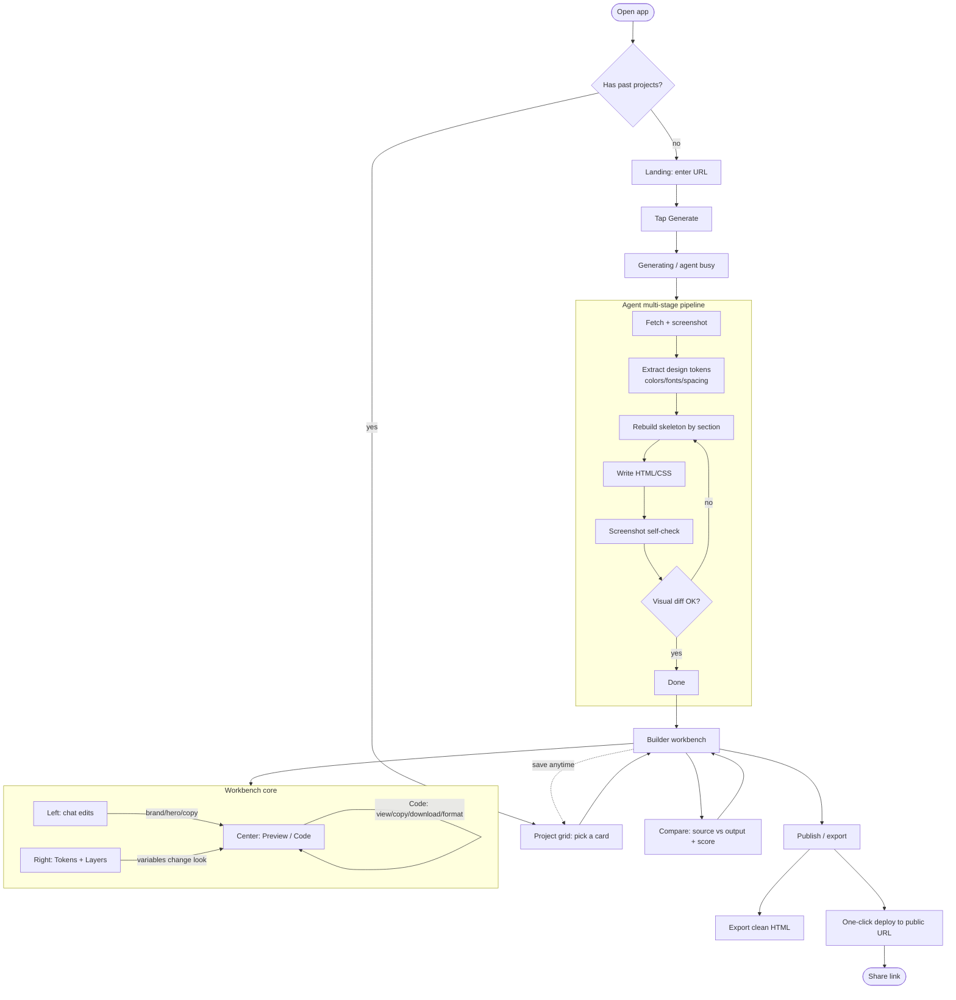
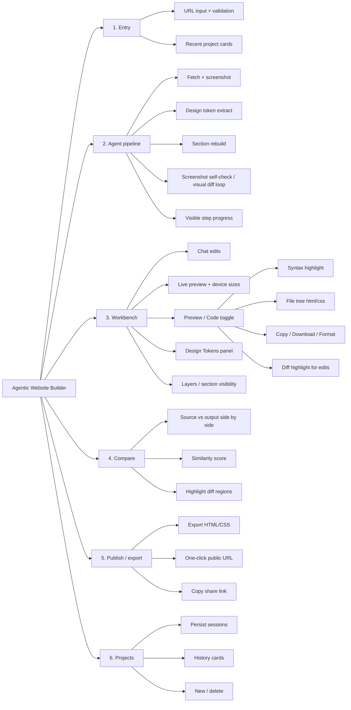
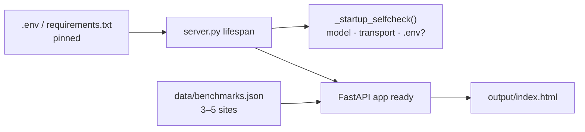
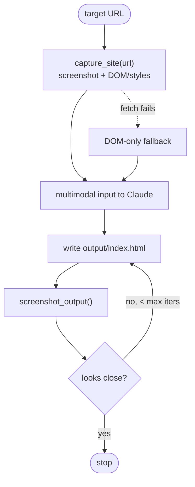
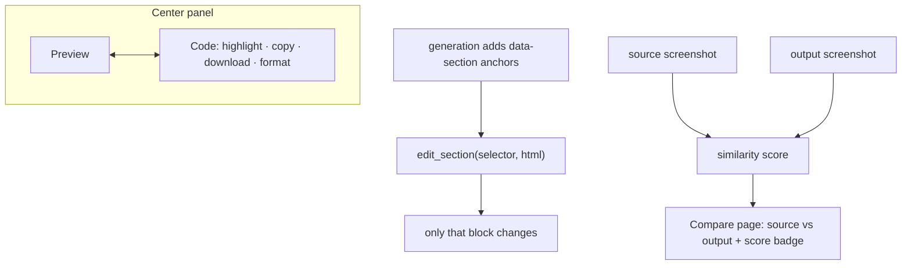
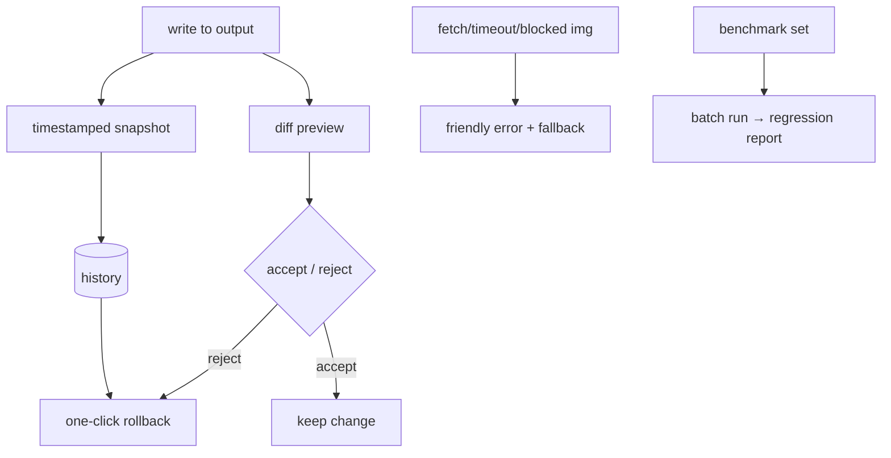
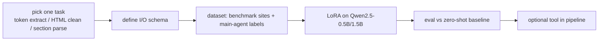
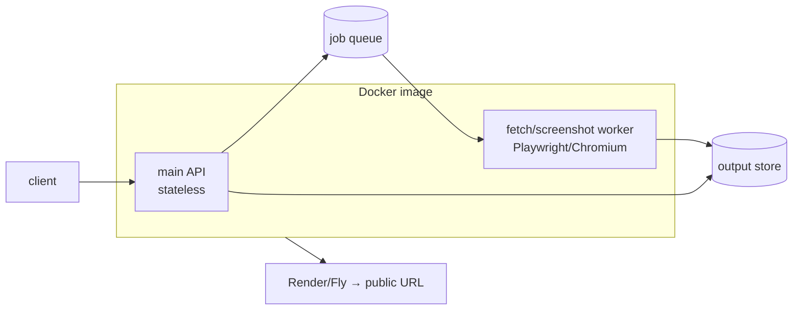

# Agentic Website Builder — project doc

> Turn a public URL into a clean site template you can edit in chat and publish in one step.
>
> This file is the product + design + engineering plan. Use it for APPROACH.md and for build work.
>
> **Supporting docs**: `[docs/ADR.md](docs/ADR.md)` (architecture decisions), `[docs/INTERVIEW.md](docs/INTERVIEW.md)` (interview prep by phase).

---

## 1. Background and positioning

This is an **agentic** task. We score **how the agent reasons, which tools it gets, and whether behavior is stable** — not fancy UI or a huge feature list.

- **Who it is for**: Founders, indie devs, marketers with no designer. They see a site they like and want a page that is **almost the same** but can swap to their brand.
- **Product shape**: **Public URL in** → AI agent makes a **clean, semantic, easy-to-change** HTML/CSS copy → refine in **chat + design tokens** → export / publish.
- **How we differ**: Unlike Builder.io (input is Figma + an existing code base, for teams with a design system), we have **no design-system setup** and **URL as input** — lighter. We still borrow their idea: **multi-stage pipeline + keep design tokens + reliability first**.

### Gaps in the starter (where we focus)

- **The agent cannot “see” design**: Only `WebFetch` (text/markdown) plus `write_html` / `read_html`. It never sees the target site or its own output as pixels.
- **Full file rewrite**: `write_html` replaces the whole doc each time. Multi-step edits are slow, easy to regress, easy to lose state.
- **No visual loop**: After a change, it cannot self-check “does it look like the target?”
- **No design tokens / asset pull**: Colors, fonts, spacing are guesses.

---

## 2. End-to-end user story

**Person**: Maya, early SaaS founder, no designer. She wants a Stripe-like page with her own brand.

1. **Entry / URL** — She sees guidance and a box. She pastes `stripe.com` and taps Generate.
2. **Agent work (visible steps)** — She sees steps: fetch page → screenshot analysis → pull colors/fonts/spacing → rebuild by section → screenshot self-check. Preview grows on the right.
3. **Workbench (core)** — Three columns: left = chat, center = live preview / code, right = Design Tokens + Layers.
4. **Chat edits** — “Make the CTA brand purple,” “Change the hero image,” “Bigger title.” Preview updates. Token edits apply globally.
5. **Code view** — Center switches to Code: clean HTML/CSS with highlight. Copy / Download / Format.
6. **Side-by-side** — One action opens **source vs mine** with a simple similarity score to show “almost the same.”
7. **Publish / export** — Export clean HTML / one-click deploy to a public URL.
8. **History** — Past sessions as cards; open any project and keep editing.

---

## 3. Screens and design refs

Design images live in `assets/`. Colors follow the starter: warm gray `#fafaf9`, near-black `#1c1917`, blue accent `#2563eb`.


| #   | Screen                      | Main UI                                                                       | Design image                    |
| --- | --------------------------- | ----------------------------------------------------------------------------- | ------------------------------- |
| 1   | **Landing / URL**           | Title, URL field + Generate, recent project cards                             | `assets/design-1-landing.png`   |
| 2   | **Generating / agent busy** | Step timeline, preview appears step by step                                   | (TBD)                           |
| 3   | **Builder workbench**       | Left chat / center preview / right Tokens + Layers                            | `assets/design-2-workspace.png` |
| 4   | **Workbench · Code**        | Preview/Code toggle, file tree, Copy/Download/Format, `:root` token highlight | `assets/design-4-codeview.png`  |
| 5   | **Compare**                 | Source vs output, score, diff highlight                                       | `assets/design-3-compare.png`   |
| 6   | **Publish / export**        | Export HTML, deploy, public URL, copy link                                    | (TBD)                           |
| 7   | **Projects / sessions**     | Card grid (thumb + URL + time), new/delete                                    | (TBD)                           |


---

## 4. User flow diagram




---

## 5. Feature tree




---

## 6. Agent and tool design

Core idea: **one agent + several focused tools + one clear workflow** (README asks for one agent, not many agents).

### Workflow (bake into system prompt)

Fetch and understand → extract design tokens → section skeleton → screenshot self-check → fix with visual diff.

### Ideas (best value first)

1. **Give the agent “eyes” — visual loop (highest leverage, good first step)**
  - Playwright: full-page screenshot of the target URL + DOM / computed styles as multimodal input.
  - Screenshot `output/index.html` too. The agent sees output vs source and fixes.
  - Replace “guess from text” with “copy from pixels + diff loop” — big fidelity win; strong demo.
2. **Extract design tokens, not a dead copy**
  - Pull palette, font stack, type scale, radius, shadow, spacing rhythm into CSS vars (`:root`).
  - Looks almost the same **and** is easy to change; “brand swap” = change a few vars.
3. **Small edit tools, not full-file rewrite**
  - Add `edit_section` / `replace_block` (by section or selector) or `patch_html` so only the touched part changes.
4. **Assets**
  - Pull hero / logo / icons locally (or placeholders) so links do not break later.
5. **Reliability / agent tuning (maps to the score rubric)**
  - Structured progress lines (fetch / colors / hero / self-check) so reasoning is visible.

---

## 7. Competitor lens: Builder.io

What they do well:

- **Deep context, not isolated generation**: Visual Copilot 2.0 uses three layers — Figma + tokens, code components + rules, APIs + data models.
- **Multi-stage pipeline, not a thin LLM shell**: Their own model (2M+ data points) turns flat design into code layers; open Mitosis compiler; fine-tuned LLM for framework fit.
- **Reliability over flashy demos**: Deterministic pieces + small models; rule: **predictable and trusted beats “newest shiny.”**
- **Two products**: Fusion (agentic IDE, agentic PRs) + Publish (headless CMS + visual editor).
- **Low lock-in + live publish**: Structured JSON / native code, publishing API.

What we borrow:


| Builder.io pattern                                                              | Our project                                                     |
| ------------------------------------------------------------------------------- | --------------------------------------------------------------- |
| Multi-stage pipeline (structure → compile → LLM polish), not one giant LLM call | Same spirit: fetch → tokens → sections → screenshot check → fix |
| Keep design tokens; change token = rebrand                                      | CSS variables; “brand color” = change vars                      |
| Reliability > demo flair; small models help the LLM                             | APPROACH.md should say what you skipped for stability           |
| Clean, maintainable, rule-following code                                        | README asks for clean / customizable HTML                       |


---

## 8. Model fine-tuning (optional ML signal)

Real constraints:

- The task scores **agentic UX**, not “we trained our own big model.” Builder’s “custom model + 2M labels” is out of scope here.
- The stack uses Claude (CLI). **You cannot fine-tune Claude**; Claude still does main generation.

Role: add **one small specialist model in the pipeline** (like Builder’s “small models help the LLM”). Pick **one** slice:

- **Design-token extractor**: screenshot/DOM → structured tokens (JSON).
- **HTML cleanup / semanticizer**: messy DOM → clean semantic skeleton.
- **Section layout parser**: full-page screenshot → section tree (JSON).

How: small open model (e.g. Qwen2.5-0.5B/1.5B) + **LoRA**, custom dataset; show **data + train + eval**; demo **before vs after**.

Risk: fine-tuning is heavy — only after the main path works.

---

## 9. Gap analysis and three tiers

Do not try to match Builder.io — you will miss the point and run out of time. Use three tiers:


| Tier                                | What goes here                                                                                                                                   |
| ----------------------------------- | ------------------------------------------------------------------------------------------------------------------------------------------------ |
| **Should do (helps agentic score)** | Scoped edits, accept/reject diff loop, version history / rollback, clear errors and fallbacks, batch runs over many sites with similarity scores |
| **On purpose “out of scope”**       | No hook-in to a real design system / live business data, no drag editor, no collab (light product by choice, not “missing work”)                 |
| **“Next step” list**                | Collab/roles, agentic PR into Git, A/B and personalization, CMS/i18n, monetization                                                               |


That maps well to APPROACH.md: what you built, tradeoffs, what you skipped on purpose, what is next — same as README “What to Deliver.”

---

## 10. Deliverables vs README


| README ask                                      | Where it lives in this plan                                                                      |
| ----------------------------------------------- | ------------------------------------------------------------------------------------------------ |
| Working software (URL in → template + iterate)  | Sections 2–5, 9 — workbench + chat loop                                                          |
| APPROACH.md (what / tradeoffs / skipped / next) | Sections 1, 6, 9 feed APPROACH                                                                   |
| Video (~5 min, `video.md`)                      | Demo script: URL → agent steps → chat → compare                                                  |
| AI session history (`./submit.sh`)              | Run `./submit.sh` at submit time                                                                 |
| Email extras: scalable API + public deploy      | Phase 6: Render/Fly; doc why screenshot service is separate, how to scale concurrency and quotas |


---

## 11. Suggested build order

1. **Visual loop** (Playwright screenshots + self-check) — biggest single win; unlocks other work.
2. **Design token extract → CSS variables** — makes “chat rebrand” real.
3. **Small edit tools** — replace full-file rewrite; better multi-turn stability.
4. **Preview/Code + side-by-side** — proves “clean” and “almost the same.”
5. **Reliability** (scope control, accept/reject diff, rollback, errors, multi-site eval).
6. (Optional) **Small-model fine-tuning** + **public deploy**.

---

## 12. Engineering roadmap

Each Phase below uses the same four-part shape so it is easy to read and to defend:

1. **Goal** — one sentence.
2. **Features / user stories** — what a user or reviewer can see.
3. **Technical approach** — diagrams + the small steps (`SX.Y`). Rule still holds: **one small change, 1–2 files when possible, easy to verify, app still runs.**
4. **Test points / exit criteria** — how we prove the phase is done before we move on.

Phases 0–3 are core. Phase 4 boosts score. Phases 5–6 are bonus.

---

### Phase 0 — Baseline hardening

> **Docs**: [Interview prep — Phase 0](docs/INTERVIEW.md#interview-phase-0) · [ADRs](docs/ADR.md) ([0001](docs/ADR.md#adr-0001) · [0002](docs/ADR.md#adr-0002) · [0003](docs/ADR.md#adr-0003) · [0004](docs/ADR.md#adr-0004))

**Goal**: Make the starter safe to iterate on — observable, repeatable, with a fixed regression baseline.

**Features / user stories**

- As a dev, I run `pip install` and `python server.py`, paste a URL, and get an HTML page in preview.
- As a dev, I switch the model with one env var, no code edit.
- As a dev, boot logs tell me which model and transport are active, and whether `.env` exists.

**Technical approach**



- **S0.1 Run the starter**: Start per README, run one URL, confirm HTML output. (1 file: none, just run)
- **S0.2 Pin env**: `requirements.txt` pinned; `model` can switch opus/sonnet/haiku via `AGENT_MODEL`.
- **S0.3 Startup self-check logs**: On boot print transport (CLI/bundled), model, whether `.env` exists (no secrets).
- **S0.4 Benchmark set**: `data/benchmarks.json` lists 3–5 target sites.

**Test points / exit criteria**

- `pip install -r requirements.txt` succeeds; `output/index.html` is created and visible.
- `AGENT_MODEL=sonnet` restart → log shows `sonnet`.
- Boot log has transport line and `.env file: present|not found`, **no key value**.
- `python3 -c "import json; json.load(open('data/benchmarks.json'))"` loads 3–5 entries.

---

### Phase 1 — Visual loop

**Goal**: Give the agent eyes — it can see the target site and its own output, then fix the gap.

**Features / user stories**

- As a user, I paste a URL and the agent produces a page that visibly matches the source layout and colors, not a text guess.
- As a user, I see the agent self-correct (it screenshots its own output and compares).

**Technical approach**



- **S1.1 Playwright**: Add deps + `playwright install chromium`; minimal script saves one PNG for a URL.
- **S1.2 `capture_site(url)` (screenshot only)**: Add in `tools.py`, register in `TOOL_HANDLERS`.
- **S1.3 Multimodal**: Pass screenshot as image input with the chat to Claude.
- **S1.4 `capture_site` + DOM/computed styles**: Add structured style data next to the screenshot.
- **S1.5 `screenshot_output()`**: Screenshot `output/index.html`.
- **S1.6 Self-check loop (system prompt)**: Fixed flow see source → generate → screenshot → compare → fix; cap iterations.
- **S1.7 Browser hardening**: Reuse context, timeouts; on fetch fail fall back to DOM-only.

**Test points / exit criteria**

- A PNG of the target lands on disk; agent can describe layout/colors from pixels.
- `capture_site` response includes key style fields (colors, font-family, sizes).
- On a benchmark URL, the loop output is **clearly better** than the text-only `WebFetch` version (manual side-by-side).
- A heavy-JS site does not crash; fallback path still returns something usable.

---

### Phase 2 — Design tokens and customization

**Goal**: Make output look like the source **and** be easy to re-brand by changing a few variables.

**Features / user stories**

- As a user, I open a Design Tokens panel, change the brand color, and the whole page updates live.
- As a user, the generated CSS uses clear variables, not scattered hard-coded values.

**Technical approach**

```mermaid
flowchart LR
    STYLES[computed styles] --> EXT["extract_design_tokens()<br/>→ tokens.json"]
    EXT --> ROOT[":root { --brand … }"]
    ROOT --> HTML[output uses var(--…)]
    PANEL[Design Tokens panel] -- edit --> RW[token read/write tool]
    RW --> ROOT
    ROOT --> PREVIEW[live preview re-renders]
```

- **S2.1 `extract_design_tokens()`**: From computed styles, emit colors/fonts/sizes/radius/shadow/spacing JSON.
- **S2.2 Generation uses CSS variables**: System prompt requires `:root { --brand … }`; site references vars.
- **S2.3 Token read/write tools**: Read/write `:root` on the current output.
- **S2.4 UI Design Tokens panel**: Right panel lists vars; edit → write back → live preview.

**Test points / exit criteria**

- Tokens for benchmark URLs look sane (real palette, real font stack).
- Generated HTML references `var(--…)` instead of repeated literals.
- Editing `--brand` (tool or panel) changes preview color globally, no full rewrite.

---

### Phase 3 — Small edits + Code view + compare

**Goal**: Stop rewriting the whole file; prove the output is clean and “almost the same.”

**Features / user stories**

- As a user, “change the hero” edits only the hero, other sections stay put.
- As a user, I switch to a Code view, read highlighted HTML, and Copy/Download/Format it.
- As a user, I open a side-by-side compare with a similarity score.

**Technical approach**



- **S3.1 Section anchors**: Generation adds stable `data-section` (hero, features, …).
- **S3.2 `edit_section(selector, html)`**: Replace one block, not the whole page.
- **S3.3 Preview/Code toggle**: Center tabs; Code shows HTML source.
- **S3.4 Code extras**: Syntax highlight + Copy/Download.
- **S3.5 File tree + Format**: If CSS split, show tree; Format button.
- **S3.6 Similarity score**: Simple image similarity between source and output screenshots.
- **S3.7 Compare page**: Left source, right output + score badge.

**Test points / exit criteria**

- Anchors exist in HTML; a hero edit does not break other sections.
- Code view: switch works; copy/download work; formatted code reads well.
- Similarity returns a believable number; compare page opens and shows the score.

---

### Phase 4 — Reliability and control (score boost)

**Goal**: Move from “it runs” to “we trust it” — versioned, reversible, with clear failure handling.

**Features / user stories**

- As a user, I can roll back a bad edit with one click.
- As a user, I see a diff of each change and can accept or reject it.
- As a user, when a fetch fails I get a clear message, not a crash.

**Technical approach**



- **S4.1 Version snapshots**: Before each write to `output`, save a timestamped snapshot.
- **S4.2 One-click rollback**: UI or API to restore last snapshot.
- **S4.3 Diff preview**: Show diff for the current change.
- **S4.4 Accept/reject change**: Reject = rollback that step.
- **S4.5 Errors and fallbacks**: Clear copy for fetch fail / timeout / blocked images.
- **S4.6 Multi-site batch**: Script runs benchmark set and logs similarity.

**Test points / exit criteria**

- History folder fills; rollback recovers after a bad edit.
- Diff shows what changed; reject restores the prior output exactly.
- A forced failure shows a friendly message, no stack trace to the user.
- Batch run over the benchmark set produces a small regression report (per-site similarity).

---

### Phase 5 — (Bonus) Small-model fine-tuning (can run in parallel)

**Goal**: Show ML depth in one small, sharp slice of the pipeline.

**Features / user stories**

- As a reviewer, I see a “before vs after fine-tune” demo on one focused task.

**Technical approach**



- **S5.1 Pick one task + I/O schema**: Token extract vs HTML cleanup vs section parse.
- **S5.2 Build dataset**: Benchmark sites + main-agent labels; spot-check by hand.
- **S5.3 LoRA train**: Qwen2.5-0.5B/1.5B scale is enough to demo.
- **S5.4 Eval + wire**: Metrics vs zero-shot baseline; optional tool in the pipeline.

**Test points / exit criteria**

- Demo shows before vs after fine-tune on the chosen task.
- Metric beats (or clearly compares to) the zero-shot baseline.
- Risk: time-box hard; if unfinished, document “designed, not trained.”

---

### Phase 6 — (Bonus) Deploy and scalable API

**Goal**: Match the email ask — a public URL and an API that can grow.

**Features / user stories**

- As a reviewer, I open a public URL and run the full flow.
- As an operator, heavy screenshot work scales on its own worker.

**Technical approach**



- **S6.1 Container**: Dockerfile with Playwright/Chromium; runs end-to-end in container.
- **S6.2 Split fetch/screenshot worker**: Separate from main API (heavy, isolate).
- **S6.3 Deploy**: Render/Fly or similar; public URL works.
- **S6.4 Scale story**: Stateless requests + job queue + concurrency/quotas → APPROACH.md.

**Test points / exit criteria**

- Full flow runs inside the container and on the public URL.
- Worker can scale on its own.
- APPROACH.md explains the scale story (stateless + queue + quotas).

---

### Time box summary


| Phase | Topic                        | Est. time | Core?         |
| ----- | ---------------------------- | --------- | ------------- |
| 0     | Baseline                     | 0.5 d     | Yes           |
| 1     | Visual loop                  | 1 d       | Yes           |
| 2     | Design tokens                | 0.5–1 d   | Yes           |
| 3     | Small edits + Code + compare | 1 d       | Yes           |
| 4     | Reliability                  | 0.5–1 d   | Yes (score)   |
| 5     | Fine-tune                    | —         | Bonus         |
| 6     | Deploy + API                 | 0.5 d     | Bonus (email) |


> Rule: **finish vertical slices first (Phase 0→1→2→3 each demoable), then harden (4), then bonus (5/6).** Prefer one small commit per step. If a phase slips, keep the main demo path and move cuts to APPROACH.md “Next.”

