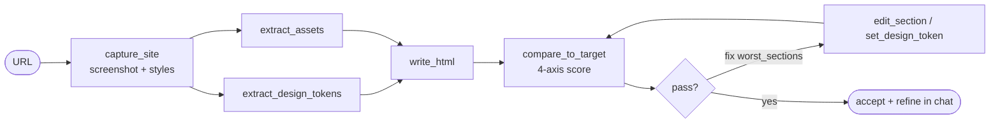

# Luma Take-Home — Agentic Website Builder

You're building the prototype of a product that lets anyone create a landing page by pointing at one they love.

Find a marketing site or landing page with a design you admire — Stripe's homepage, a YC startup's landing page, a beautifully designed product page. Paste the URL, and an AI agent creates a clean, customizable template very closely inspired by that design. Then you tweak it through conversation: "Swap the hero image," "Make the CTA more prominent," "Use our brand colors."

**Build the AI agent that powers this.**

**You must use AI coding tools** — Claude Code, Cursor, Codex, whatever you prefer. These problems are scoped so that AI is necessary to ship something real in a day. We want to see how you direct the tools: how you plan, how you course-correct, what you accept, and what you push back on.

---

## This Submission

> Full rationale in [`APPROACH.md`](APPROACH.md). Plan + roadmap in [`IDEA.md`](IDEA.md). Decisions in [`docs/ADR.md`](docs/ADR.md).

One agent, **10 MCP tools**, and a measured `look → build → measure → fix` loop that beats a naked one-shot by **+0.23 mean fidelity** on the benchmark set.



**Tools** (beyond the scaffold's `write_html` / `read_html`):

| Tool | Role |
|------|------|
| `capture_site` / `screenshot_output` | Tiled screenshots + computed styles (the agent's eyes) |
| `extract_design_tokens` / `read_design_tokens` / `set_design_token` | `:root` CSS vars = single source of truth for rebrand |
| `extract_assets` | Mirror logo / hero / SVG / fonts to `output/assets/` |
| `compare_to_target` | 4-axis fidelity report (content · structure · layout · visual) + diff heatmap |
| `edit_section` | Surgical one-block edit, no full rewrite |

**UI surfaces**: live Preview · Code · Compare · **Insights** (convergence curve + A/B) · **History** (snapshot / diff / rollback).

### Fidelity profiles

| Profile | Optimizes | Asset gate |
|---------|-----------|:----------:|
| `more_editable` | clean, semantic code | off |
| `balanced` *(default)* | layout + visual match | off |
| `more_faithful` | pixel + real assets | ≥ 0.75 |

### Architecture

| Module | Responsibility |
|--------|----------------|
| `server.py` + `routes/` | FastAPI app + routers (site, sse, compare, insights, history, tokens, agent) |
| `server_state.py` | SSE broadcast + session/lock state (no app import cycle) |
| `agent_loop.py` | Claude SDK options + `look→build→measure→fix` run loop |
| `prompts.py` | Profile-aware system prompts |
| `tools/` | MCP tool implementations + schema generation |
| `compare/` | Pure-Python fidelity scoring (no Playwright) |
| `browser.py` · `assets.py` · `tokens.py` · `sections.py` · `history.py` · `convergence.py` | Capture, asset mirror, tokens, edits, snapshots, A/B |

### Run & verify

```bash
pip install -r requirements.txt
python -m playwright install chromium     # screenshots need Chromium
cp .env.example .env                       # Claude CLI login also works
AGENT_MODEL=opus python server.py          # opus = closest copy; haiku = cheap dev

# unit + script checks (no browser needed)
python scripts/verify_phase2.py   # fidelity scoring
python scripts/verify_phase3.py   # design tokens
python scripts/verify_phase4.py   # section edits
python scripts/verify_phase5.py   # history / rollback / errors
python scripts/verify_phase6.py   # convergence + A/B
```

**Recommended model**: `AGENT_MODEL=opus` for the closest visual copy; `haiku` (default) for cheap iteration ([ADR 0002](docs/ADR.md#adr-0002)).

---

## Getting Started

A scaffold is provided: a server, a live preview, a chat interface, and two tools (`write_html`, `read_html`, plus builtins) wired to the Claude Agent SDK.

```bash
# 1. Create your own private repo and push to it
git init && git add -A && git commit -m "initial"
gh repo create my-take-home --private --source=. --push

# 2. Install dependencies
pip install -r requirements.txt

# 3. Set up your API key
cp .env.example .env
# Edit .env and add your Anthropic API key

# 4. Start the server
python server.py
# Open http://localhost:8000
```

Paste a URL. See what happens. Then make it better.

The scaffold is intentionally minimal — it gives you the wiring but barely any capabilities. The agent can write HTML and read it back, plus built-in tools. What you build from there is the challenge. Feel free to replace existing tools and add new ones.

You're welcome to reimagine this as more of a product if you want. Keep in mind that this is an **agentic** challenge, so we care most about the agentic experience, not flashy UX or broader product capabilities.

---

## Tips

The candidates who do best don't start by building — they start by getting sharp on the problem. It's easy to either throw everything at the wall or get heads-down on making something work, and miss the more important question: *what's actually worth solving here, and for whom?*

Slow down before you write a line of code. The thinking you do upfront will shape everything.

---

## What We're Looking For

We want to see a real, working agentic product — not a demo that almost works. The agent should handle a real URL and produce something that looks nearly identical to the template site. We care most about the agentic experience: how the agent reasons, what tools you give it, and how you've shaped its behavior to get good results reliably.

We expect the result to be better than what an AI would produce on its own with minimal guidance. Your judgment about tool design, agent behavior, and where to draw the product boundaries — that's what we're evaluating. Specifically, we're paying attention to:

- **How you approach new problems** — how you break down ambiguity, decide what to tackle first, and make good decisions with incomplete information
- **How you use AI tools** — not just that you used them, but how you directed them, where you pushed back, and where your judgment shaped the result
- **The unique perspective you bring** — the product instincts or agentic design sensibility that made your solution distinct from what anyone else would have built

---

## What to Deliver

### 1. Working software

We should be able to paste a URL and get a usable template, and be able to refine it. Include setup instructions that work.

### 2. APPROACH.md

- What you built and why
- Key decisions and tradeoffs
- What you intentionally left out
- What you'd build next

### 3. Video walkthrough

Record a short video (~5 minutes) showing what you built. Demo the key flows — paste a URL, show the agent working, refine the result through conversation — explain your decisions, and highlight anything you're particularly proud of. This is your chance to show us the experience through your eyes.

**Paste your video link (Loom, Google Drive, YouTube, etc.) into** `video.md`**.**

### 4. AI session history

Your AI session logs are packaged automatically when you run `./submit.sh`. This is a required deliverable — we review how you work, not just the result.

---

## Submitting

```bash
./submit.sh
```

---

## Logistics

### 💸 Costs & API keys

We'll reimburse up to $100 total. Don't commit secrets — use `.env`.

### ⏱️ Time

~8 hours. No strict deadline, but typically within 2–3 days.

### 🤙🏽 Questions

Ask anytime — treat this like working with a teammate.
