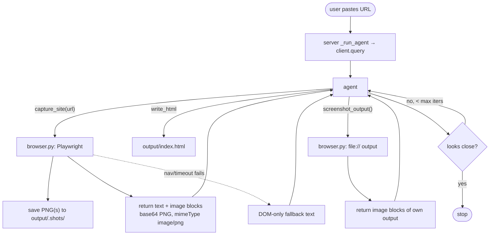

# Phase 1 — Visual loop (technical plan)

This file is the **persisted** engineering plan for Phase 1 (see also [`IDEA.md`](../IDEA.md) §12 Phase 1 and ADR [`0005`](ADR.md#adr-0005) for the accepted implementation). It was derived from the original Cursor plan and updated for paths and repo layout.

## Goal

The agent sees the **target site** and its **own output** as real screenshots, then self-corrects — replacing guesswork from `WebFetch` text with **copy from pixels** plus a self-check loop.

## Why MCP image blocks (de-risked)

The agent runs via the Claude Code CLI transport and is driven through MCP tools. The clean way to get pixels into the model is to return an **image content block** from a tool result (supported by `claude-agent-sdk` when serializing tool output to the CLI). **No change to `client.query()` multimodal messages is required** — tools return `{"type":"image","data":...,"mimeType":"image/png"}` inside `content`.

## Data flow

## Implementation map (repo files)

| Step | What was built | Where |
|------|------------------|--------|
| S1.1 | Pinned `playwright==1.60.0`; install Chromium with `python -m playwright install chromium` | [`requirements.txt`](../requirements.txt) |
| S1.2 | Reused Chromium, tiled `capture_url`, `capture_file`; `capture_site` / `screenshot_output` tools | [`browser.py`](../browser.py), [`tools.py`](../tools.py) |
| S1.3 | MCP handler passes through structured `content` (text + image) | [`tools.py`](../tools.py) `_make_handler`, `_normalize_tool_result` |
| S1.4 | `page.evaluate` style JSON (palette, typography, sections, samples) | [`browser.py`](../browser.py) `_EXTRACT_STYLES_JS` |
| S1.5 | `screenshot_output()` → `capture_file(output/index.html)` | [`tools.py`](../tools.py) |
| S1.6 | System prompt: look → build → self-check → iterate (cap 2–3 rounds in prose) | [`server.py`](../server.py) `SYSTEM_PROMPT` |
| S1.7 | Lock, nav timeout, DOM-only fallback; `close_browser()` on app shutdown | [`browser.py`](../browser.py), [`server.py`](../server.py) `lifespan` |

Screenshots on disk: `output/.shots/` (under gitignored `output/`).

## Step checklist (original plan)

### S1.1 — Playwright (deps)

- Pin Playwright in `requirements.txt` (currently `1.60.0`).
- Run `python -m playwright install chromium`.
- **Check:** `python -m playwright --version`; Chromium runs.

### S1.2 — `browser.py` + `capture_site(url)`

- Lazy-launched shared Chromium; `asyncio.Lock` around capture.
- Viewport width 1280; vertical tiles (clip) up to 4 tiles × ~1400px height.
- **Check:** PNG files appear under `output/.shots/` for a real URL.

### S1.3 — Image blocks (multimodal tool result)

- Tools may return `{"content": [{"type":"text",...}, {"type":"image","data":b64,"mimeType":"image/png"}, ...]}`.
- **Check:** Agent can describe layout/colors from a captured page.

### S1.4 — DOM / computed styles

- Same tool response includes a text block with **Extracted styles (JSON)**.
- **Check:** JSON has real fields on a non-trivial marketing page.

### S1.5 — `screenshot_output()`

- Renders `file://…/output/index.html` and tiles the same way.
- **Check:** After `write_html`, tool returns image tiles of the preview.

### S1.6 — Self-check loop in system prompt

- Order: `capture_site` → `write_html` → `screenshot_output` → fix gaps; repeat up to 2–3 times in instructions; `max_turns=30` in agent options.
- **Check:** Benchmark URL output beats text-only `WebFetch` (manual compare).

### S1.7 — Robustness

- Reuse browser; timeouts; on failure return DOM-only text + styles (no images).
- **Check:** Heavy JS site does not crash the server; fallback message is usable.

## Notes

- **No Phase 1 UI** for a dedicated compare dashboard — that stays in later roadmap phases (see `IDEA.md` Phase 4 compare UI, Phase 2 fidelity automation).
- **Tiling** avoids one giant screenshot being unreadable in the model context.
- **ADR:** Implementation rationale and alternatives are recorded as [`0005 — Phase 1 visual loop: Playwright + MCP image blocks`](ADR.md#adr-0005).

## Phase 1 exit criteria (done when)

- PNGs exist on disk for a target URL.
- The agent can reason from screenshots (not only from `WebFetch` text).
- `capture_site` returns real style JSON alongside images.
- The documented see → build → self-check loop is reflected in `SYSTEM_PROMPT` and is demonstrably better than the pre–Phase 1 baseline on at least one benchmark site (manual judgment).
