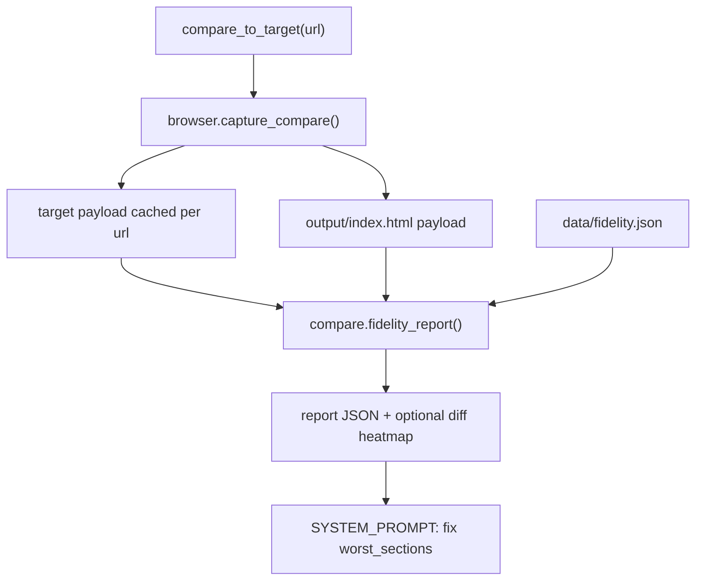
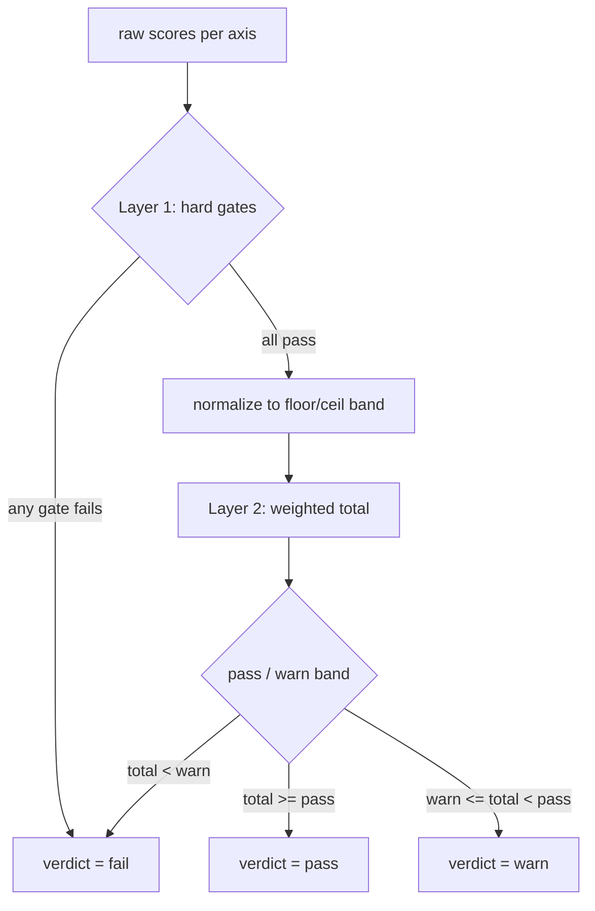
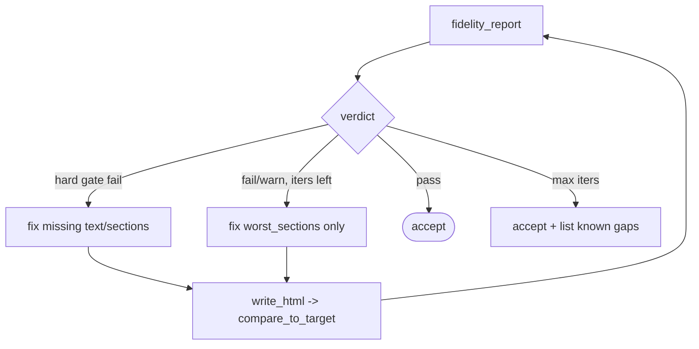
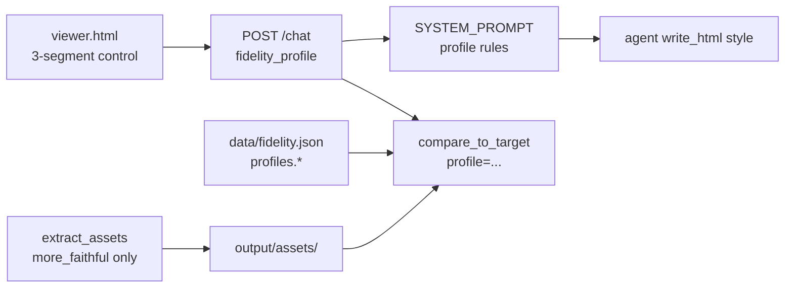

# Phase 2 — Fidelity verification (technical plan)

Persisted engineering plan for Phase 2. See [`IDEA.md`](../IDEA.md) §12 Phase 2 and ADR [`0006`](ADR.md#adr-0006).

## Goal

Turn Phase 1's subjective "looks close?" into **measured** scores on four axes — content, structure, layout, visual — with pass/warn/fail thresholds the agent loop and reviewers can use.

## Data flow



## Implementation map

| Step | What | Where |
|------|------|--------|
| S2.1 | Text coverage + order | [`compare.py`](../compare.py) `score_content` |
| S2.2 | Skeleton / landmark order | [`compare.py`](../compare.py) `score_structure` |
| S2.3 | Section bounding-box IoU | [`compare.py`](../compare.py) `score_layout` |
| S2.4 | SSIM + pHash per tile | [`compare.py`](../compare.py) `score_visual` |
| S2.5 | Weighted report + two-layer thresholds | [`compare.py`](../compare.py) `fidelity_report` |
| S2.6 | `compare_to_target(url)` MCP tool | [`tools.py`](../tools.py) |
| S2.7 | Prompt loop + batch script | [`server.py`](../server.py), [`scripts/fidelity_batch.py`](../scripts/fidelity_batch.py) |
| Capture | Compare payload from DOM | [`browser.py`](../browser.py) `_EXTRACT_COMPARE_JS`, `capture_compare()` |

## Threshold design (two layers)

**Do not use one global number.** Each axis has its own scale; 0.70 on content means "lots of copy missing" but 0.70 on visual (SSIM) is already a strong match.



### Layer 1 — per-axis hard gates

| Axis | Gate | Why |
|------|------|-----|
| content | coverage >= 0.95 | Missing copy is a real bug |
| structure | landmark order exact (off by default) | Semantic HTML vs div-heavy source DOM |
| layout | each block IoU >= 0.30 | Severe misplacement |
| visual | none | Pixels are noisy; no veto |

### Layer 2 — normalized weighted total

```
norm_i = clamp((raw_i - floor_i) / (ceil_i - floor_i), 0, 1)
total  = sum(weight_i * norm_i)   # default 0.30 / 0.20 / 0.30 / 0.20
```

Defaults in [`data/fidelity.json`](../data/fidelity.json). Calibrate with:

```bash
python scripts/fidelity_batch.py output/index.html --calibrate
```

### When it does not pass



## Fidelity knob (3 profiles)

Users pick **more_editable ↔ balanced ↔ more_faithful** before generating. One field (`fidelity_profile`) drives **both** generation and scoring.



| Profile | User goal | Prompt (generation) | Scoring (engineering) |
|---------|-----------|---------------------|------------------------|
| **more_editable** | Cleanest code | Semantic tags; logo placeholders OK | structure weight **0**; assets **informational** |
| **balanced** (default) | Product sweet spot | Semantic + layout/visual match | assets **informational** only |
| **more_faithful** | Closest look + real assets | `extract_assets` + `/assets/...` (images, backgrounds, inline SVG, fonts) | **asset_coverage** gated (≥0.75) + 20% weight |

### Asset mirroring (scheme B)

- Tool: **`extract_assets(url)`** → `output/assets/manifest.json` (+ `fonts/`, inline SVG files)
- Preview: **`GET /assets/{path}`**
- Compare: **`asset_coverage`** = mirrored logo/favicon/hero/**font** referenced in `output/index.html`
- **Only `more_faithful`** enforces asset gate and lists missing assets in `worst_sections`

ADR: [`0008`](ADR.md#adr-0008).

## Exit criteria

- `compare_to_target()` returns all four axes + `worst_sections`.
- Footer deletion drops structure/layout and names footer.
- Heading-only text change drops content, not layout.
- Visual score stable across two identical runs.
- `python scripts/fidelity_batch.py output/index.html` prints per-site table.

## Verify locally

```bash
python scripts/verify_phase2.py
python scripts/fidelity_batch.py output/index.html --url https://example.com
```
