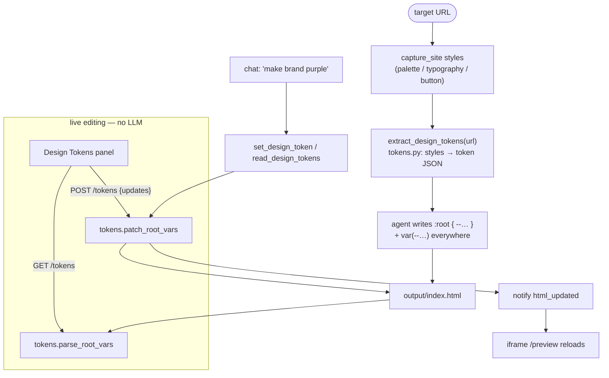

# Phase 3 — Design tokens and customization (technical plan)

Persisted engineering plan for Phase 3. See [`IDEA.md`](../IDEA.md) §12 Phase 3 and ADR [`0009`](ADR.md#adr-0009).

## Goal

Make the output look like the source **and** be re-brandable by editing a few variables. The
generated page authors a `:root { --token: value }` block and references `var(--…)` everywhere;
a Design Tokens panel (and chat) edits those variables live with **no full-file rewrite**.

## Why this shape

- **One source of truth = the `:root` block inside `output/index.html`.** No sidecar
  `tokens.json` that can drift from the HTML. The panel and tools parse/patch `:root` directly.
- **Instant edits bypass the LLM.** A color tweak (panel slider or `POST /tokens`) is a string
  patch + preview reload — cheap, deterministic, reversible. The agent is only needed for
  *seeding* tokens (generation) or *semantic* edits ("make the CTA purple").
- **Canonical names align prompt ↔ panel ↔ tools.** A fixed token vocabulary in
  [`tokens.py`](../tokens.py) is referenced by the system prompt, grouped by the panel, and
  validated by tools — so they never disagree on `--color-brand` vs `--brand`.

## Data flow



## Implementation map

| Step | What | Where |
|------|------|-------|
| S3.1 | `tokens.py`: canonical vocab, `extract_tokens_from_styles`, `parse_root_vars`, `patch_root_vars`, `categorize`, `rgb_to_hex` | [`tokens.py`](../tokens.py) (new) |
| S3.1 | Extend style capture with `boxShadow` + radius/spacing samples | [`browser.py`](../browser.py) `_EXTRACT_STYLES_JS` |
| S3.1 | `extract_design_tokens(url)` MCP tool → token JSON | [`tools/handlers_tokens.py`](../tools/handlers_tokens.py) |
| S3.2 | Prompt: require `:root` tokens + `var(--…)`; seed via `extract_design_tokens` | [`server.py`](../server.py) `_SYSTEM_PROMPT_BASE`, `_PROFILE_BUILD_RULES` |
| S3.3 | `read_design_tokens()` + `set_design_token(name, value)` MCP tools | [`tools/handlers_tokens.py`](../tools/handlers_tokens.py) |
| S3.3 | `GET /tokens` + `POST /tokens` (panel, no LLM) | [`server.py`](../server.py) |
| S3.4 | Design Tokens panel (list, color pickers, live write-back) | [`viewer.html`](../viewer.html) |
| S3.5 | Unit checks | [`scripts/verify_phase3.py`](../scripts/verify_phase3.py) (new) |

## Token model

Canonical vocabulary (in `tokens.py`), grouped for the panel. The prompt uses exactly these names.

| Category | Tokens | Notes |
|----------|--------|-------|
| color | `--color-brand`, `--color-accent`, `--color-bg`, `--color-surface`, `--color-text`, `--color-muted`, `--color-border` | hex (or `rgba()` if alpha < 1) |
| typography | `--font-base`, `--font-heading`, `--text-base`, `--text-scale`, `--leading`, `--weight-heading` | font stacks + base size + modular scale |
| shape | `--radius`, `--radius-lg`, `--shadow` | from button / card samples |
| spacing | `--space-unit`, `--space-section` | rhythm unit + section gap |

- **Extraction** maps captured computed styles → tokens: dominant non-neutral palette color →
  `--color-brand`; body bg/text → `--color-bg`/`--color-text`; button bg → `--color-accent`;
  `buttonSample.borderRadius` → `--radius`; `bodyFontFamily`/`h1FontFamily` → `--font-*`.
  Colors normalized to hex; unknowns fall back to the starter palette (`#fafaf9` / `#1c1917` /
  `#2563eb`) so the page never renders token-less.
- **Source of truth** at runtime is the real `:root` in `output/index.html`. Extraction only
  *seeds* generation.

## Parse / patch contract (`tokens.py`)

```
parse_root_vars(html)  -> {"--color-brand": "#2563eb", ...}   # first :root block only
patch_root_vars(html, updates) -> html'                        # replace existing, append missing
categorize(name) -> "color" | "typography" | "shape" | "spacing" | "other"
rgb_to_hex("rgb(37,99,235)") -> "#2563eb"  (keeps rgba() when alpha < 1)
```

- `patch_root_vars` edits **inside the first `:root { … }`** via targeted regex per property;
  missing tokens are appended before the closing `}`. Everything else in the file is byte-for-byte
  preserved (no reformat) so edits are minimal and diff-friendly.
- If no `:root` exists yet, `POST /tokens` returns an empty list (panel shows "no tokens yet");
  the agent is responsible for authoring the block during generation.

## Endpoints (panel, no LLM)

| Method | Path | Body / Returns |
|--------|------|----------------|
| GET | `/tokens` | `{tokens: [{name, value, category}]}` parsed from `output/index.html` |
| POST | `/tokens` | body `{updates: {"--color-brand": "#7c3aed"}}` → patch `:root`, write, notify `html_updated`, return updated list |

Reuses the same `tokens.py` parser as the tools, so panel edits and agent edits behave identically.

## Tools (agent / chat)

- **`extract_design_tokens(url)`** — capture styles, map to canonical token JSON, return it for the
  agent to author `:root`. Called once after `capture_site`.
- **`read_design_tokens()`** — parse current `:root` so the agent can reason about existing values.
- **`set_design_token(name, value)`** — patch one variable (chat "make the CTA brand purple" → one
  call, no rewrite), then notify `html_updated`.

All three live in `tokens.py` logic and register in `TOOL_HANDLERS` (schemas auto-generated).

## Prompt change (S3.2)

Add to `_SYSTEM_PROMPT_BASE` (applies to **all** profiles — tokens help every fidelity level):

- Define a single `:root` block using the **canonical token names** above; set real captured
  values. Reference `var(--token)` for every color, font, radius, and key spacing — **no repeated
  literals**.
- Workflow step 1.5: after `capture_site`, call `extract_design_tokens(url)` and use the returned
  values to seed `:root`.
- For follow-up rebrand requests, prefer `set_design_token` over rewriting the page.

## UI panel (S3.4)

- Collapsible right-side panel in the builder, toggled from the toolbar (alongside the fidelity
  control). Hidden on landing.
- On builder enter and on every `html_updated` SSE, fetch `GET /tokens` and render grouped rows:
  - **color** → `<input type="color">` + hex text field (kept in sync).
  - **typography / shape / spacing** → text input.
- Change handler is debounced (~250 ms) → `POST /tokens {updates}` → server patches + notifies;
  the iframe reloads. The panel re-fetches tokens (not a full rebuild) to avoid focus loss.
- Empty state: "Generate a page to see its design tokens."

## Exit criteria

- Tokens for benchmark URLs look sane (real palette + font stack), not the starter defaults.
- Generated HTML references `var(--…)` for colors/fonts/radius instead of repeated literals.
- Editing `--color-brand` (panel or `set_design_token`) changes the preview globally with **no full
  rewrite** (diff touches only the `:root` line).
- `POST /tokens` round-trips: parse → patch → re-parse returns the new value; rest of HTML unchanged.

## Verify locally

```bash
python scripts/verify_phase3.py
# manual: generate a page, open the panel, drag --color-brand, watch the preview recolor
```

## Out of scope (Phase 3)

- Per-component token overrides / themes (light-dark switch) — single `:root` only.
- Token history / undo — covered by Phase 5 snapshots + rollback.
- Spacing/shadow extraction is best-effort (one sample); not a full design-system audit.
