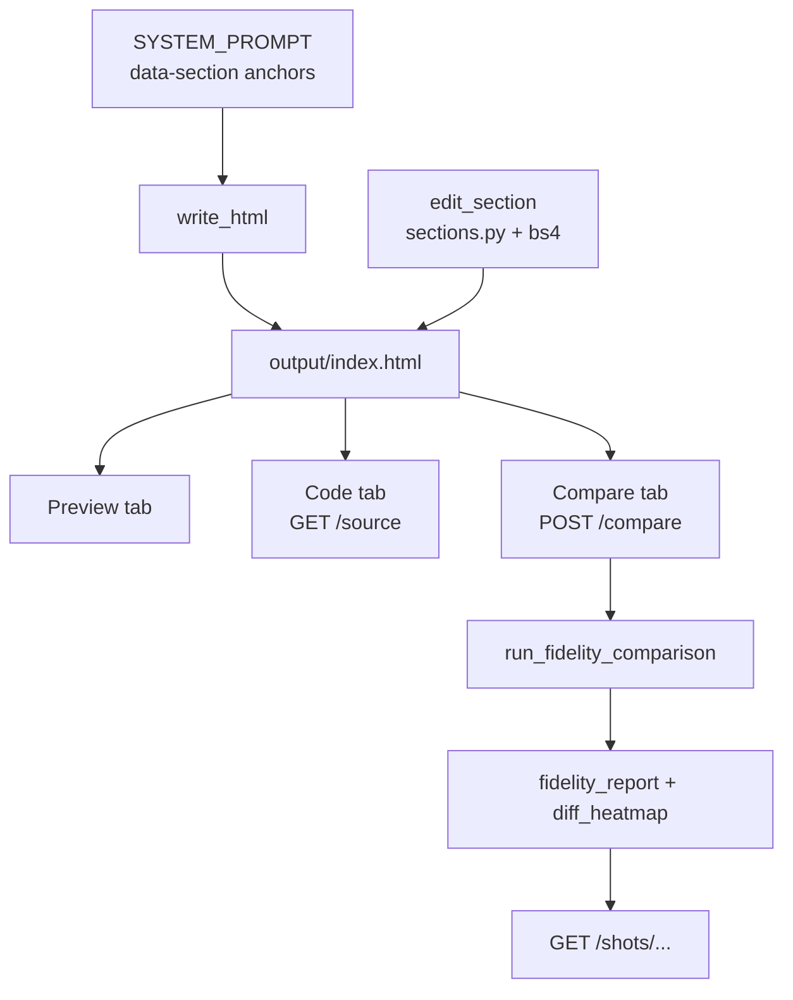

# Phase 4 — Small edits + Code view + Compare (technical plan)

Persisted engineering plan for Phase 4. See [`IDEA.md`](../IDEA.md) §12 Phase 4 and ADR [`0010`](ADR.md#adr-0010).

## Goal

Stop rewriting the whole file on every edit; prove the output is clean and "almost the same" via Code view and a visual Compare panel.

## Data flow



## Implementation map

| Step | What | Where |
|------|------|--------|
| S4.1 | `data-section` anchors in prompt | [`server.py`](../server.py) `_SYSTEM_PROMPT_BASE` |
| S4.2 | `replace_section` / `list_sections` | [`sections.py`](../sections.py) |
| S4.2 | `edit_section` MCP tool | [`tools/handlers_html.py`](../tools/handlers_html.py) |
| S4.3 | `GET /source` | [`server.py`](../server.py) |
| S4.4 | Code tab: highlight, Copy, Download, Format | [`viewer.html`](../viewer.html) |
| S4.6 | `run_fidelity_comparison` shared helper | [`tools/handlers_fidelity.py`](../tools/handlers_fidelity.py) |
| S4.7 | `POST /compare`, `GET /shots/{path}` | [`server.py`](../server.py) |
| S4.7 | Compare tab UI | [`viewer.html`](../viewer.html) |
| S4.8 | Unit checks | [`scripts/verify_phase4.py`](../scripts/verify_phase4.py) |

## Section editing

- Resolution order: CSS selector → `[data-section="name"]` → `#id` → tag name.
- `edit_section("hero", html)` patches one block; on miss, returns available `data-section` names.
- Agent prompt: follow-up edits prefer `edit_section` over full `write_html`.

## Compare panel

- `POST /compare` body: `{url, profile}` — no LLM; runs Playwright capture + Phase 2 scoring.
- Returns: `report`, `source_tiles`, `output_tiles`, `heatmap` (URLs under `/shots/`).
- UI shows per-axis scores, gate failures, worst sections, side-by-side tiles, diff heatmap.

## Out of scope

- Multi-file / CSS split file tree (single `index.html` output).
- Edit history / rollback (Phase 5).
- Format writes back to disk (display-only).

## Exit criteria

- `edit_section` changes one `data-section` block; other sections unchanged (`verify_phase4.py`).
- Code tab: switch, copy, download, format work.
- Compare tab shows four-axis breakdown + heatmap, not one number.

## Verify locally

```bash
pip install beautifulsoup4
python scripts/verify_phase4.py
```
