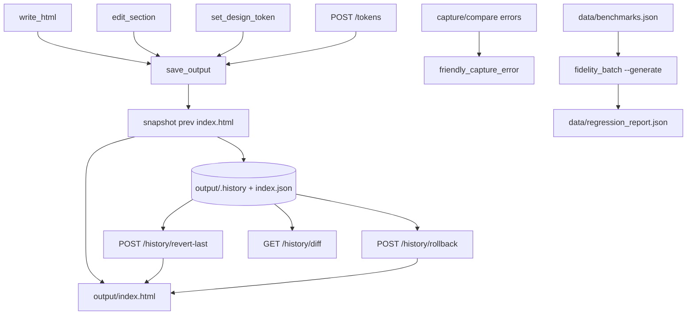

# Phase 5 — Reliability and control (technical plan)

Persisted engineering plan for Phase 5. See [`IDEA.md`](../IDEA.md) §12 Phase 5 and ADR [`0011`](ADR.md#adr-0011).

## Goal

Move from "it runs" to "we trust it" — versioned, reversible output with clear failure handling and a multi-site regression report.

## Data flow



## Implementation map

| Step | What | Where |
|------|------|--------|
| S5.1 | Snapshot-before-write | [`history.py`](../history.py) `save_output()` |
| S5.2 | One-click rollback API + UI | [`server.py`](../server.py), [`viewer.html`](../viewer.html) |
| S5.3 | Unified diff preview | `history.diff()` + History panel |
| S5.4 | Revert last = reject last change | `POST /history/revert-last` |
| S5.5 | Friendly capture errors | [`browser.py`](../browser.py) `friendly_capture_error()` |
| S5.6 | Agent batch regression | [`scripts/fidelity_batch.py`](../scripts/fidelity_batch.py) `--generate` |

## Write funnel

All four write paths call `save_output(html, label)`:

- `write_html` → `"write_html"`
- `edit_section` → `"edit-{selector}"`
- `set_design_token` → `"token-{name}"`
- `POST /tokens` → `"tokens-panel"`

The latest history entry is always the **pre-change** state, so `revert_last()` restores exactly one step back. Rollback also snapshots the current file first (reversible).

## History storage

- `output/.history/{seq:04d}-{ts}-{label}.html` — snapshot files
- `output/.history/index.json` — ordered manifest (max 50 entries, oldest trimmed)
- Covered by gitignored `output/`

## Friendly errors

Playwright/network failures map to short user copy (timeout, DNS, SSL, navigation). Long traces never reach the UI. Compare and capture tools use the same helper.

## Regression batch

```bash
python scripts/fidelity_batch.py --generate --profile balanced
```

For each benchmark in `data/benchmarks.json`:

1. Clear `output/index.html`
2. Run the agent end-to-end via Claude SDK
3. Score output vs that URL (Phase 2 four-axis report)
4. Backup HTML to `output/regression-{id}.html`
5. Write `data/regression_report.json`

Without `--generate`, existing score-only behavior is unchanged.

## Out of scope

- Multi-file history (single `index.html` only)
- Branching / named checkpoints
- Accept/reject modal on every agent write (revert-last covers the UX)

## Exit criteria

- History folder fills; rollback recovers after a bad edit
- Diff shows what changed; revert restores prior output exactly
- Forced failure shows friendly message, no stack trace in UI
- `--generate` produces per-site regression report

## Verify locally

```bash
python scripts/verify_phase5.py
```
