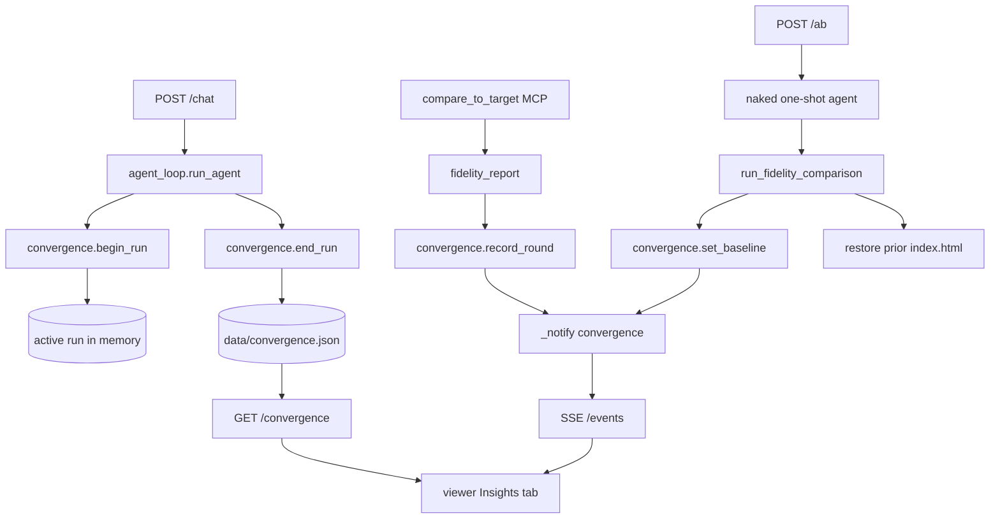

# Phase 6 — Self-convergence + A/B proof (technical plan)

Persisted engineering plan for Phase 6. See [`IDEA.md`](../IDEA.md) §12 Phase 6, [`INTERVIEW.md`](INTERVIEW.md#interview-phase-6), and ADR [`0012`](ADR.md#adr-0012).

## Goal

Make the agent’s **look → measure → fix** loop **visible and measurable** in the product UI:

- Plot **fidelity total** across each `compare_to_target` self-check (convergence curve).
- Show **which `worst_sections` were fixed** between rounds (chips struck through when resolved next round).
- Optional **A/B**: score an unguided **one-shot** build (restricted tools + “no self-check” prompt) vs the loop result, without clobbering the user’s saved output.

This directly supports the README bar: *better than what an AI would produce on its own with minimal guidance*.

## Data flow



## Implementation map

| Step | What | Where |
|------|------|--------|
| S6.1 | Begin/end active run per agent turn | [`agent_loop.py`](../agent_loop.py) `run_agent` → [`convergence.py`](../convergence.py) `begin_run` / `end_run` |
| S6.2 | Attach session id when detected | `convergence.set_active_session` from new `.jsonl` or `ResultMessage` |
| S6.3 | Append round on each compare | [`tools/handlers_fidelity.py`](../tools/handlers_fidelity.py) `compare_to_target` → `record_round` + `_notify("convergence")` |
| S6.4 | Persist runs + baseline per session | [`convergence.py`](../convergence.py) `data/convergence.json` |
| S6.5 | Read state for UI | `GET /convergence?session_id=…` in [`routes/insights.py`](../routes/insights.py) |
| S6.6 | A/B naked baseline | `POST /ab` → [`agent_loop.py`](../agent_loop.py) `run_naked_baseline` → restricted `ClaudeAgentOptions` via `_build_agent_options(tool_subset=…)` |
| S6.7 | Insights UI | [`viewer.html`](../viewer.html) tab `insights`, `loadInsightsPanel`, SSE `convergence` |

## APIs

| Method | Path | Purpose |
|--------|------|---------|
| `GET` | `/convergence?session_id={uuid}` | Returns `{ runs, baseline, active }` for the Insights view. `active` is the in-flight run (live rounds before `end_run`). |
| `POST` | `/ab` | Body: `{ "url", "session_id", "profile" }`. Runs one-shot agent, scores, stores baseline, restores `output/index.html`. |

## SSE

- Event name: **`convergence`** (same envelope as other events: `{ "version", "event" }`).
- Emitted after each successful `record_round` and after `end_run` / `set_baseline`, so the Insights tab updates while the agent runs.

## Storage (`data/convergence.json`)

- One object keyed by **session id** (UUID string).
- Each value: `{ "runs": [ run, … ], "baseline": { … } | null }`.
- Each **run**: `{ session_id?, url, profile, started, ended?, rounds: [ … ] }`.
- Each **round**: `{ round, ts, total, verdict, axes, worst, gate_failures }` (compact slice of the fidelity report).
- **Baseline** (A/B): `{ total, verdict, axes, url, ts }` from the scored one-shot output.
- File is local state (like `sessions.json`); safe to gitignore if you prefer not to commit demo data.

## A/B baseline (fair “naked” arm)

- **Tools allowed**: `capture_site`, `write_html` only (no `compare_to_target`, no `edit_section`, etc.).
- **System prompt**: `_NAKED_SYSTEM_PROMPT` — one capture, one write, no iteration.
- **After scoring**: previous `output/index.html` bytes are written back so the user’s loop-built page is unchanged.

## Verification

```bash
python scripts/verify_phase6.py
```

Manual:

1. Start from landing, pick a URL, let the agent run (multiple `compare_to_target` calls).
2. Open **Insights** — curve and first→final delta should reflect real rounds.
3. Click **Run A/B baseline** (costs an extra agent run) — one-shot line and “vs one-shot” card should appear.

## Out of scope (Phase 6)

- Automatic A/B on every build (too expensive).
- Multi-tab concurrent agents (single `_agent_lock` + single active run).
- Statistical A/B (repeated runs / confidence intervals) — future enhancement.

## Related

- Phase 2 scoring: [`phase-2-fidelity.md`](phase-2-fidelity.md)
- Phase 5 snapshots (restore after bad iteration is a natural next harness): [`phase-5-reliability.md`](phase-5-reliability.md)
